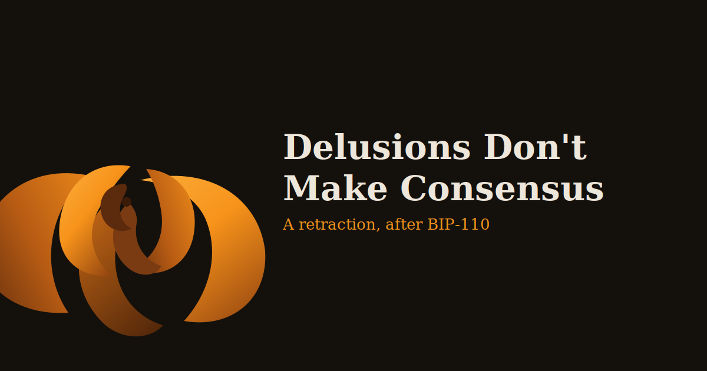

# 🥀 Delusions Don't Make Consensus

An argument, written in the days after Bitcoin's BIP-110 soft fork collapsed at block 961,633.

BIP-110 tried to change Bitcoin's rules through a User Activated Soft Fork, needed 55% miner signaling, got 2.53%, split off a minority chain that mined exactly two blocks in fifteen hours, and stalled while the main network moved on 26 blocks ahead. This site isn't a technical post-mortem — it argues that BIP-110's underlying technical grievance (node operators storing arbitrary data forever for a fee miners collect once) was real, but that what actually earned the word "delusional" was the community's reaction once the fork failed: CSAM accusations lobbed at anyone who didn't run Knots, Flat Earth talk surfacing in the same channels, and a refusal to accept 2.53% signaling as a real answer.

The piece is explicit about its own limits: it doesn't claim technical authority on whether BIP-110's design was sound. It draws a clear line between the mechanics (well-documented, sourced, not in dispute) and the community behavior that's actually being evaluated. It's built around direct quotes from Jameson Lopp, Michael Saylor, Adam Back, Jason Hughes, Luke Dashjr, and David Schwartz, cross-referenced against reporting from Bitcoin Magazine, KuCoin News, crypto.news, The Defiant, CryptoSlate, and others — all listed in full at the bottom of the page, organized by category (fork mechanics, the Dashjr BIP-editor removal, replay-attack risk, opposition and proponent arguments).

The hero image and favicon are the same illustration: a wilted rose with its petals rendered in Bitcoin's signature orange (#F7931A), drooping on a dried stem. It's meant to sit at the top of the page as the thesis, not the decoration.

## Deployment

Static site, no build step. Push the contents of this repo to a GitHub Pages–enabled repository (root or `/docs`, either works) and it's live. Everything — HTML, favicons, SEO files, and the article itself — is a flat file at the repo root; no subfolders to reorganize.

## License

MIT — see `LICENSE`.
